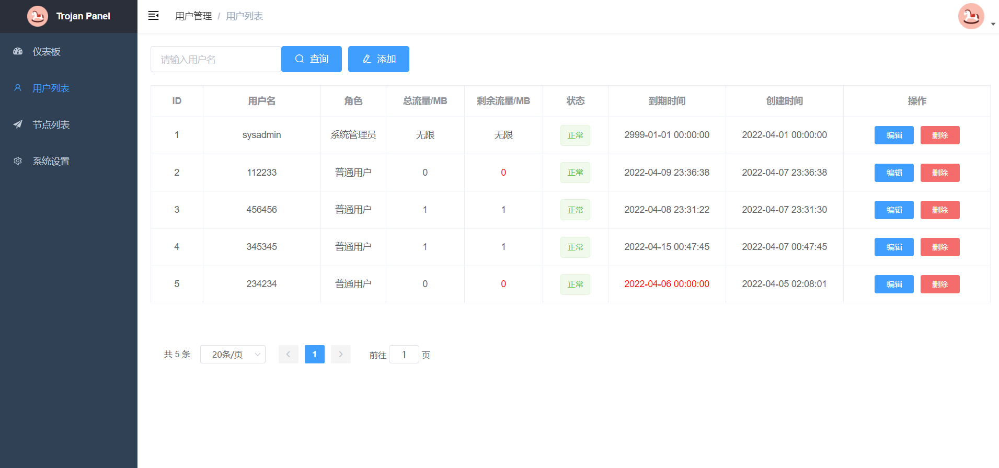

# Install Script

支持trojan-gfw/trojan-go的可视化管理面板，节点类型支持trojan-gfw+Caddy+Web+TLS和trojan-go+Caddy+Web+TLS+Websocket。

# Installation

For CentOS 6+:

```shell
yum install -y wget;wget --no-check-certificate https://github.com/trojanpanel/install-script/raw/main/install_script.sh;chmod 777 install_script.sh;./install_script.sh
```

For Ubuntu 16+/Debian 8+:

```shell
apt install -y wget;wget --no-check-certificate https://github.com/trojanpanel/install-script/raw/main/install_script.sh;chmod 777 install_script.sh;./install_script.sh
```

# Enjoy!

<p float="left">
  
  
</p>

# Features

1. 3分钟傻瓜式一键安装所有服务，占内存小
2. 自动申请/续签证书
3. 集成Trojan Panel可视化管理面板
4. 节点类型支持trojan-gfw+Caddy+Web+TLS和trojan-go+Caddy+Web+TLS+Websocket
5. 支持数据库版节点集群和单机版节点

# Documentation

请参考[Wiki](https://github.com/trojanpanel/install-script/wiki)

# Bugs & Issues

[Trojan Panel交流群](https://t.me/TrojanPanelGroup)

# Thanks

- [trojan-gfw](https://github.com/trojan-gfw/trojan)
- [trojan-go](https://github.com/p4gefau1t/trojan-go)
