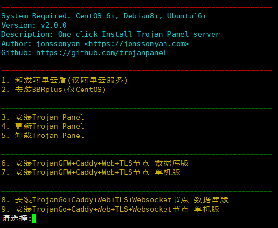

# Install Script

一键安装Trojan Panel控制面板，一键安装Trojan-gfw+Caddy+Web+TLS，一键安装Trojan-go+Caddy+Web+TLS+Websocket，支持数据库版节点集群和单机版节点。

# Installation

For CentOS 6+:

```shell
yum install -y wget;wget --no-check-certificate https://github.com/trojanpanel/install-script/raw/main/install_script.sh;chmod 777 install_script.sh;./install_script.sh
```

For Ubuntu16+/Debian8+:

```shell
apt install -y wget;wget --no-check-certificate https://github.com/trojanpanel/install-script/raw/main/install_script.sh;chmod 777 install_script.sh;./install_script.sh
```

# Enjoy!



# Features

1. 5分钟极速安装所有服务，并且占内存小
2. 自动申请/续签证书
3. 集成Trojan Panel控制面板
4. 集成Trojan-gfw和Trojan-go
5. 支持数据库版节点集群和单机版节点

# Documentation

请参考[Wiki](https://github.com/trojanpanel/install-script/wiki)

# Bugs & Issues

[Trojan Panel交流群](https://t.me/TrojanPanelGroup)
